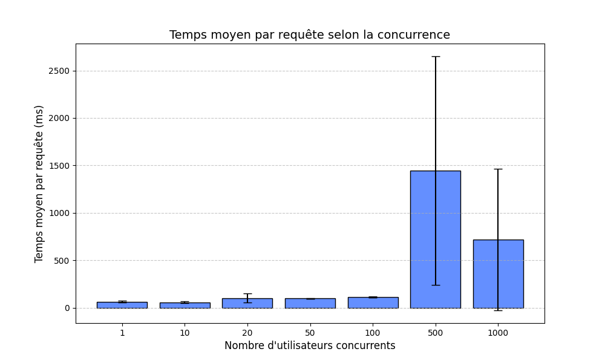
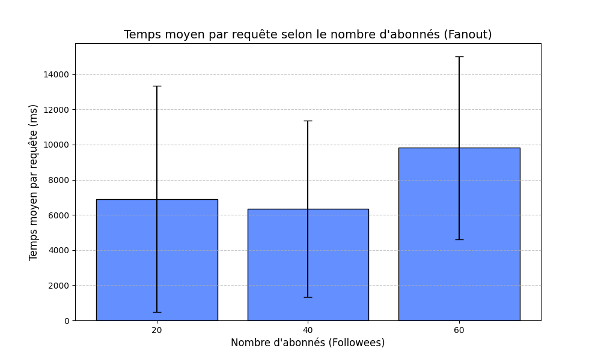

# elouan-rousseau-tinyinsta

URL de la webapp : https://tp1-elouanrousseau.ew.r.appspot.com 

Le fichier locustfile.py a été généré grâce à Gemini.

### Expérience 1 : Passage à l'échelle sur la charge
Commande lançant le fichier seed.py qui permet de remplir la base de données avec les paramètres nécessaires pour l'expérience :
```bash
python seed.py --users 1000 --posts 50000 --follows-min 20 --follows-max 20
```

### Expérience 2 : Passage à l'échelle sur la taille des données
Commande lançant le fichier seed.py qui permet de remplir la base de données avec les paramètres nécessaires pour l'expérience : 
```bash
python seed.py --users 1000 --posts 100000 --follows-min 20 --follows-max 20
```
On ajoute ensuite pour tester avec 40 puis 60 followees.

### Graphique expérience 1 : 




### Observations expérience 1 :

Suite à notre première expérience, nous pouvons remarquer que le temps moyen par requête est similaire de 1 à 100 utilisateurs et que ces temps de réponses sont rapides (moins de 150ms).

Mais pour 1000 utilisateurs, le temps moyen par requête explose car l'application ne peut pas traiter immédiatement ce flux. Grâce à l'augmentation des instances, le temps moyen du deuxième et du troisième run est nettement inférieur au premier, cela explique la grande variance qu'on peut observer sur cette colonne.

On remarque donc que le système est assez instable et a besoin de créer un grand nombre d'instances pour supporter une grosse charge.

Pour cette expérience, on peut en conclure que l'application est capable de passer à l'échelle sur la charge, pas par l'efficacité de son code mais seulement grâce à son infrastructure Cloud qui crée les instances nécessaires.


### Graphique expérience 2 : 




### Observations expérience 2 :

Pour cette deuxième expérience, les temps moyen de requêtes ont explosé par rapport à ceux de l'expérience 1, avec des moyennes de 1000ms à 10000ms, et un pic à 13500ms. 

Pour 20 abonnés, le temps de requête est acceptable et la variance est très faible, tout comme le pourcentage d'erreur, même si la structure a besoin de 3 à 4 instances pour gérer le flux.

Lorsqu'on passe à 40 abonnés par utilisateur, les temps de requête ont déjà plus que triplé (3500ms en moyenne), cela donne un temps d'attente déjà assez long à l'utilisateur, et ce n'est pas l'idéal pour l'application.

Mais le temps moyen explose pour 60 abonnés par utilisateur, avec 10000ms de moyenne, ce qui est énorme et rend l'application peu utilisable voire inutilisable, car l'utilisateur attend une dizaine de secondes que sa page d'accueil se charge. Une grande variance est également observée pour cette colonne, ce qui s'explique par le grand nombre d'instances (jusqu'à 20) créées pour supporter la charge, ce qui occasionne une perte de temps, surtout au niveau du premier run.

Le système était en difficulté pour exécuter ces requêtes rapidement, ce qui est expliqué aussi par la grande variance qui montre une instabilité, ainsi que par l'augmentation de requêtes en échec (FAILED) car le système n'a pas pu les traiter correctement.

C'est logique car pour afficher la timeline le serveur doit parcourir la liste des abonnements et rassembler tous les posts, ce qui exige un très grand nombre de requêtes quand le nombre d'abonnements augmente et explique le temps moyen par requête largement supérieur à celui de la première expérience.


### Conclusion

L'architecture actuelle de l'application a montré ses limites lors de ces expériences et ne scale donc pas correctement.

Sur la charge : L'application arrive à tenir la charge uniquement grâce à l'infrastructure matérielle, ce passage à l'échelle est coûteux (multiplication des instances) et cause des lenteurs lors du pic à 1000 utilisateurs.

Sur la taille des données : L'architecture est défaillante et s'effondre totalement lorsque le nombre d'abonnés augmente, donnant des temps de réponses ne rendant pas l'application agréable voire pas utilisable pour l'utilisateur.
